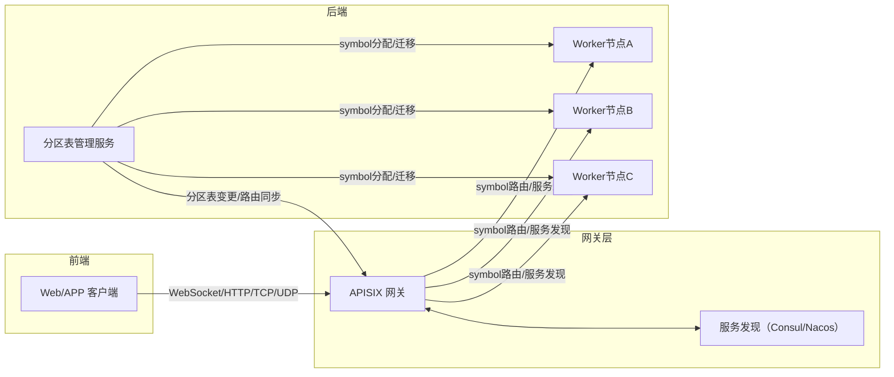

# 撮合系统分区、Worker节点、撮合引擎与Symbol关系说明

## 架构图（升级版）



## 0. 核心概念定义
- **分区（Partition）**：撮合系统中 symbol（交易对）分配和管理的逻辑单元。每个分区负责一组 symbol，分区表动态维护 symbol 到分区的映射。
- **Worker节点**：撮合服务实例，负责一组分区（symbol）的撮合任务。每个 Worker 节点内部运行撮合引擎实例。
- **撮合引擎实例**：Worker 节点内部的核心模块，负责订单撮合、行情推送等业务。
- **Symbol**：交易对（如 BTC/USDT），是撮合系统的最小业务单元。
- **分区迁移事件**：分区扩缩容或故障恢复时，symbol 从一个分区/worker迁移到另一个分区/worker的过程。

## 1. 架构升级目标
- 引入统一 WebSocket 网关（推荐 APISIX），前端只连接统一域名，网关自动路由到对应 Worker 节点。
- 分区（Partition）仅作为 symbol（交易对）分配和管理的逻辑单元，不直接暴露给前端。
- Worker 节点负责一组 symbol 的撮合服务，撮合引擎实例运行在 Worker 节点内部。
- 分区迁移、扩缩容、节点变更等对前端完全透明，无需前端重连或关心迁移事件。

## 2. 关键设计原则
- 前端始终连接统一 WebSocket 域名，由网关自动路由。
- 分区表和 Worker 节点管理逻辑只在后端维护，前端无需关心分区ID或节点地址。
- 分区迁移、节点扩容时，网关自动完成流量切换，保证业务连续性。
- 撮合引擎实例与分区、Worker节点的关系通过后端分区表动态维护。

## 3. 典型流程
1. 用户前端连接 WebSocket 网关（如 ws.example.com）。
2. 网关根据 symbol 路由到对应 Worker 节点（服务发现自动同步实例，路由规则由分区表驱动）。
3. Worker 节点内部撮合引擎处理订单、行情等业务。
4. 分区迁移或节点变更时，网关自动切换流量，无需前端重连。

## 4. 分区扩缩容与消息迁移机制（对标 Redis）
### 4.1 分区扩缩容流程
- 后端通过分区表动态调整 symbol 到分区/worker 的分配，实现扩容或缩容。
- 分区迁移时，symbol 的撮合队列、订单簿等数据需要从源分区/worker迁移到目标分区/worker。
- 迁移过程可参考 Redis 的分片迁移机制，采用异步迁移+重定向策略。

### 4.2 消息迁移与一致性保障
- 迁移期间，源分区/worker对 symbol 的新订单、撤单等消息进行重定向，转发到目标分区/worker。
- 支持迁移锁或迁移标记，保证迁移期间不会有消息丢失或乱序。
- 迁移完成后，目标分区/worker接管 symbol 的所有撮合服务。
- 可选：迁移期间支持双写或消息队列缓冲，提升一致性和高可用。

### 4.3 迁移事件处理
- 前端无需关心迁移事件，所有迁移和消息重定向由后端自动完成。
- 网关层始终路由到最新的分区/worker，保证业务连续性。

## 5. 参考架构图

```
+-------------------+      +-------------------+      +-------------------+
|    前端客户端     | ---> |   WebSocket网关   | ---> |   Worker节点A     |
| (ws.example.com)  |      |   (APISIX/Kong)   |      | (撮合引擎实例)    |
+-------------------+      +-------------------+      +-------------------+
                                 |                        |                
                                 |                        |                
                                 v                        v                
                          +-------------------+   +-------------------+   
                          |   Worker节点B     |   |   Worker节点C     |   
                          | (撮合引擎实例)    |   | (撮合引擎实例)    |   
                          +-------------------+   +-------------------+   

服务发现系统（Consul/Nacos） <--- Worker节点注册/健康上报 ---> Worker节点A/B/C
服务发现系统（Consul/Nacos） <--- Worker节点注册/健康上报 ---> APISIX网关自动发现
分区表管理服务 <--- symbol到worker映射/迁移 ---> APISIX网关路由规则自动同步
分区表管理服务 <--- symbol到worker映射/迁移 ---> Worker节点A/B/C
```

- 网关层（APISIX）统一入口，服务发现自动同步 worker 实例，路由规则由分区表驱动。
- 分区表管理服务负责 symbol 到 worker 的映射和迁移，变更时自动同步 APISIX 路由。
- Worker 节点注册到服务发现系统，APISIX 自动发现。

## 6. 详细方案
### 6.1 网关层设计（APISIX 实现）
- 采用 APISIX 作为统一 WebSocket 网关，前端始终连接统一域名（如 ws.example.com）。
- APISIX 根据 symbol、用户ID等信息做路由，自动转发到对应 Worker 节点。
- 分区迁移、扩缩容、故障恢复时，APISIX 实时根据后端分区表自动切换流量，无需前端重连或关心迁移事件。
- 支持负载均衡、健康检查、灰度发布、限流等高级功能。
- 后端分区表变更后，APISIX 可通过配置中心（如 etcd/Consul）或自定义插件自动同步路由规则。

### 6.2 分区迁移机制

#### 6.2.1 分区迁移机制参考设计（对标 Redis/IM 系统）

#### 迁移流程详细步骤
1. **迁移准备**
   - 后端分区管理模块发起迁移任务，标记待迁移 symbol 的迁移状态。
   - 源 Worker 节点到目标 Worker 节点建立迁移通道，准备数据同步。
2. **异步数据迁移**
   - 源 Worker 节点将 symbol 的订单簿、撮合队列等核心数据异步同步到目标 Worker 节点。
   - 迁移期间，源节点对 symbol 加迁移锁/标记，防止并发写入和数据不一致。
3. **消息重定向**
   - 迁移期间，所有新订单、撤单、成交等消息由源节点实时重定向到目标节点。
   - 可选：采用消息队列缓冲，保证消息顺序和一致性。
4. **迁移完成通知**
   - 目标节点完成数据接收和恢复，通知分区管理模块迁移完成。
   - 分区表切换 symbol 的归属到目标节点，解除迁移锁/标记。
5. **分区表切换与网关路由同步**
   - 分区表更新后，APISIX 网关自动同步最新路由规则，所有流量自动切换到目标节点。
   - 源节点停止对该 symbol 的撮合服务。

#### 迁移期间一致性保障
- 迁移锁/标记防止并发写入和数据不一致。
- 消息重定向机制保证迁移期间所有业务消息都能正确路由和处理。
- 支持迁移期间双写、消息队列缓冲等高级一致性策略。
- 迁移完成后，业务无缝切换，前端完全无感知。

#### 迁移机制优势
- 迁移过程异步、自动化，支持高并发和大规模分区扩缩容。
- 结合 APISIX 网关自动路由，迁移对前端完全透明。
- 机制可对标 Redis/IM 系统的分片迁移，适合撮合、IM、实时推送等高并发场景。

### 6.2.2 分区迁移调度与任务管理（结合自动化监控）

- **自动扩缩容触发**
  - 系统通过监控分区负载（如订单量、撮合延迟、CPU/内存等指标），自动判断是否需要扩容或缩容。
  - 达到阈值后，自动触发分区迁移任务，无需人工干预。

- **迁移任务队列与调度**
  - 后端维护分区迁移任务队列，支持批量迁移、优先级控制、任务重试。
  - 迁移任务由调度器自动分发到各 Worker 节点，保证迁移过程有序、可控。

- **任务状态管理与监控**
  - 每个迁移任务有状态跟踪（待执行、进行中、完成、失败），支持进度监控和告警。
  - 迁移过程中自动收集关键指标（如迁移耗时、消息延迟、数据��致性），便于运维和优化。

- **故障恢复与回滚**
  - 迁移失败时，支持自动回滚或重新分配，保证业务高可用。
  - 迁移任务与分区表、网关路由同步，确保流量始终指向健康节点。

- **与网关协同**
  - 迁移任务��成后，自动通知 APISIX 网关同步最新分区表和路由规则，实现流量无缝切换。

### 6.3 撮合引擎实例
- Worker 节点内部运行撮合引擎实例，负责分配到本节点的 symbol 的撮合服务。
- 支持多线程/协���并发撮合，订单簿、行情等业务模块解耦。

### 6.4 故障恢复与高可用
- 节点故障时，分区表自动迁移 symbol 到其他健康节点。
- 网关自动检测节点健康，流量切换无感知。
- 支持多租户、灰度发布、流量镜像等高级功能。

### 6.5 前后端解耦
- 前端始终连接统一域名，无需关心分区、节点、迁移等后端细节。
- 后端分区表和节点管理逻辑完全自动化，支持弹性伸缩和高可用。

## 7. 选型建议
- 网关推荐 APISIX（云原生友好、性能高、插件丰富），也可选 Kong、Nginx、Envoy。
- 分区表建议存储于 etcd/Consul，支持动态扩缩容。
- Worker 节点建议容器化部署，便于弹性伸缩。

## 8. 未来扩展
- 支持多租户、灰度发布、流量镜像等高级功能。
- 分区与 Worker 节点关系可动态调整，支持高可用和故障恢复。

---
如需详细设计方案或代码实现建议，可进一步补充。
